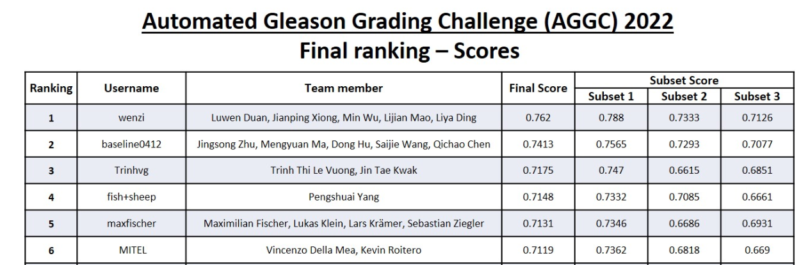

# Automated Gleason Grading Challenge 2022


This repository contains the Inference script and the final trained model that was submitted to the [Automated Gleason Grading Challenge 2022] (https://aggc22.grand-challenge.org/). 
If you use parts of this Repository please cite the following work:
```
Challenge Paper: Huo, Xinmi, et al. "Comprehensive AI Model Development for Gleason Grading: From Scanning, Cloud-Based Annotation to Pathologist-AI Interaction" (Preprint available under: https://papers.ssrn.com/sol3/papers.cfm?abstract_id=4172090)
International Conference on Medical Image Computing and Computer-Assisted Intervention.
Cham: Springer Nature Switzerland, 2022.
```
And you must give credit to the submission paper:
```
Maximilian Fischer, Lukas Klein, Lars Krämer, Sebastian Ziegler: Semi-supervised automated Gleason Grading on WSI. AGGC Challenge 2022
```

The submitted model achieved an overall accuracy throughout the test set of 0.7131. 


## Installation
1) Create a new conda new conda environment with the recent version of Python,
as an example: `conda create --name AGGC python=3.9`
2) Install pytorch with the most recent CUDA version by following the instructions on the
[PyTorch Website](https://pytorch.org/get-started/locally/).
3) Clone this repository and install its dependencies:
```
https://github.com/MIC-DKFZ/AGGC2022.git
cd AGGC2022
pip install -e .
```

## Copyright
Copyright German Cancer Research Center (DKFZ) and contributors.
Please make sure that your usage of this code is in compliance with its
[license](https://github.com/MIC-DKFZ/AGGC2022/master/LICENSE).


## Acknowledgements
This work was partially funded by Helmholtz Imaging (HI), a platform of the Helmholtz Incubator on Information and Data Science and by the Research Campus M2OLIE, which was funded by the German Federal Ministry of Education and Research (BMBF) within the Framework “Forschungscampus: Public-private partnership for Innovations” under the funding code 13GW0388A.